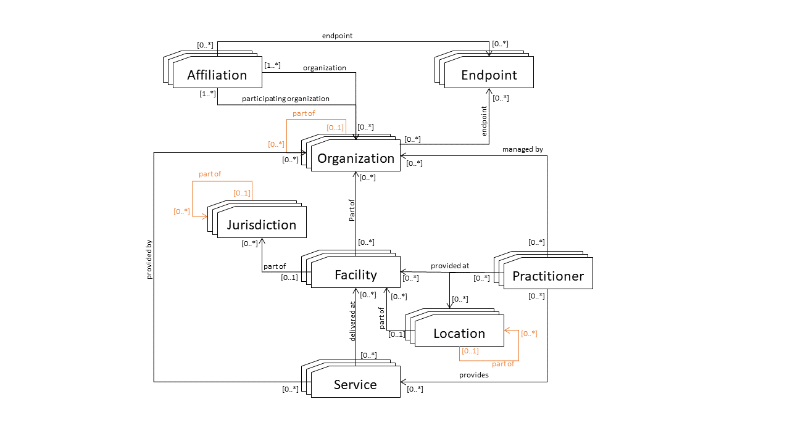

# EHMI Endpoint Register (EER)

The EHMI Endpoint Register (EER) Profile supports discovery of Endpoint adresses related to a SOR Unit in Danish Healthcare using a RESTful interface.

The profile is based upen IHE mCSD profile and the use cases and solutions using mCSD are outlined in the [mCSD White Paper](https://profiles.ihe.net/ITI/papers/mCSD/index.html).

This profile supports registration of and querying for:

## 1. Organization

Organizations are “umbrella” entities; these may be considered the administrative bodies under whose auspices care services are provided such as Healthcare Information Exchanges(HIEs), Integrated Delivery Networks (IDNs), Non-Government Organizations (NGOs), Faith-Based Organizations (FBOs) or even a one-physician family practice. An organization has a unique identifier and may have additional administrative attributes such as contact person, mailing address, etc. Departments of an institution, or other administrative units, may be represented as child Organizations of a parent Organization.

    **SOR IE Organization** – is reflected as a Jurisdiction instead of Organization (see [Jurisdiction](Jurisdiction))

    **SOR SI Organization** – is reflected as a Facility instead of Organization (see [Facility](Facility))  

    **SOR OE Organization** – is reflected as a real Organization with [Location](Location)s and [Endpoint](Endpoint)s

## 2. Facility

Facilities are physical care delivery sites such as hospitals, clinics, health outposts, physician offices, labs, pharmacies, etc. A Facility has a unique identifier, geographic attributes (address, geocode), contact attributes, attributes regarding its hours of operation, etc. Each Facility is defined by a pairing of Location and Organization.

    **SOR SI Organization** – is reflected as a Facility instead of Organization (see [Facility](Facility))  

## 3. Location

Locations are physical places where care can be delivered such as facilities, buildings, wards, rooms, or vehicles. Locations also include jurisdictions such as a village districts or regions. A Location has a unique identifier and may have geographic attributes (address, geocode), attributes regarding its hours of operation, etc. Each Location may be related to one Organization. A location may have a hierarchical relationship with other locations.

## 4. Jurisdiction

Jurisdictions are political administrative units or other territories over which authority is exercised. A Jurisdiction has a unique identifier, geographic attributes, etc. Jurisdictions include political administrative units such as village districts or regions. Each Jurisdiction is defined by a pairing of Location and Organization.

    **SOR IE Organization** – is reflected as a Jurisdiction instead of Organization [See more...](Jurisdiction))

## 5. Practitioner

A Practitioner is a health worker such as defined by WHO (in Chapter 1 of the [World Health Report 2006](http://whqlibdoc.who.int/publications/2006/9241563176_eng.pdf)); a Practitioner might be a physician, nurse, pharmacist, community health worker, district health manager, etc. Practitioners have contact and demographic attributes. Each Practitioner may be related to one or more Organizations, one or more Locations and one or more Healthcare Services. Specific attributes may be associated with the Practitioner relationship with these other entities.

## 6. Healthcare Service

Each healthcare service has a unique identifier. Examples include surgical services, antenatal care services, or primary care services. The combination of a Healthcare Service offered at a Location may have specific attributes including contact person, hours of operation, etc. [See more...](Healthcare-Service)
    
## 7. Endpoint

An Organization may be reachable for electronic data exchange through electronic Endpoint(s). An Endpoint may be a FHIR server, an IHE web services actor, or some other mechanism. If an Organization does not have an Endpoint, it may still be reachable via an Endpoint at its parent Organization or an affiliated Organization. [See more...](Endpoint)

## 8. OrganizationAffiliation

An Organization may have relationships with other organizations that are not hierarchical. These relationships may indicate an electronic routing path to other organizations that cannot be reached directly. OrganizationAffiliation can be used to specify relationships such as supply chains or administrative reporting structures.

The capabilities detailed in this profile support consumer-centric queries such as finding “where is the closest youth mental health services clinic” or “what are the hours of a physiotherapist near my workplace”. In addition, EHMI CSD supports crucial health system management workflows. This can include reporting and analyses, such as “what are my health human resource capacities, by facility, by cadre,” “what are all the services offered at this facility,” or conversely, “where are all the facilities that offer this service.” The EHMI CSD Profile may be employed to support, for example, the Provider Queries listed by the US Office of the National Coordinator as part of the [Standards and
Interoperability Framework](https://www.healthit.gov/topic/interoperability/standards-interoperability-si-framework). In addition, EHMI CSD can enable connectivity by providing service endpoint lookup, such as "What is the FHIR server for this organization?".

The loosely coupled design and flexible querying capability of the EHMI CSD Profile means it can be deployed within a variety of eHealth architectures and support a wide array of care workflows.

## 1:46.4.1 Concepts

The EHMI Endpoint Register (EER) Profile supports queries for resources related to care services discovery. The relationship between these entities is illustrated in Figure 1:46.4.1-1.

**Figure 1:46.4.1-1: Top-level Relationships between Care Services Entities**

# Core Profiles

[EHMI SOR Organization](https://build.fhir.org/ig/medcomdk/dk-ehmi-mCSD/StructureDefinition-EHMI.SOR.Organization.html)

EHMI SOR General Organization

[EHMI SOR Institution Owner Organization](https://build.fhir.org/ig/medcomdk/dk-ehmi-mCSD/StructureDefinition-EHMI.SOR.InstitutionOwner.Organization.html)

EHMI SOR Institution Owner Organization IO (DK:IE)

[EHMI SOR Healthcare Institution Organization](https://build.fhir.org/ig/medcomdk/dk-ehmi-mCSD/StructureDefinition-EHMI.SOR.HealthcareInstitution.Organization.html)

EHMI SOR Healthcare Institution Organization HI (DK:SI)

[EHMI SOR Organizational Unit](https://build.fhir.org/ig/medcomdk/dk-ehmi-mCSD/StructureDefinition-EHMI.SOR.OrganizationalUnit.Organization.html)

EHMI SOR Organizational Unit OU (DK:OE)

[SOR HealthcareService](https://build.fhir.org/ig/medcomdk/dk-ehmi-mCSD/StructureDefinition-medcom.sor.HealthcareService.html)

A profile on the HealthcareService resource for SOR.

[EHMIMessageDefinition](https://build.fhir.org/ig/medcomdk/dk-ehmi-mCSD/StructureDefinition-EHMIMessageDefinition.html)

A profile on the MessageDefinition resource for EHMI SOR. (Attempting to replace entries in the standardcatalogues from both MedCom and SDS)

## Extended Profiles

### SOR IO (DK: IE)

[EHMI SOR Institution Owner Municipality Organization](https://build.fhir.org/ig/medcomdk/dk-ehmi-mCSD/StructureDefinition-EHMI.SOR.InstitutionOwner.Municipality.Organization.html)

EHMI SOR Institution Owner Municipality Organization IO (DK:IE), a specialization of "EHMI SOR Institution Owner Organization IO (DK:IE)" focused on the municipality's profile.

[EHMI SOR Institution Owner Regional Organization](https://build.fhir.org/ig/medcomdk/dk-ehmi-mCSD/StructureDefinition-EHMI.SOR.InstitutionOwner.Regional.Organization.html)

EHMI SOR Institution Owner Regional Organization IO (DK:IE), a specialization of "EHMI SOR Institution Owner Organization IO (DK:IE)" focused on the region's profile.

### SOR HI (DK: SI)

[EHMI SOR Healthcare Institution Hospital Organization](https://build.fhir.org/ig/medcomdk/dk-ehmi-mCSD/StructureDefinition-EHMI.SOR.HealthcareInstitution.Hospital.Organization.html)

EHMI SOR Healthcare Institution Hospital Organization HI (DK:SI), a specialization of "EHMI SOR Healthcare Institution Organization HI (DK:SI)" focused on the hospital's profile.

### SOR OU (DK: OE)

[EHMI SOR Organizational Unit Hospital Organization](https://build.fhir.org/ig/medcomdk/dk-ehmi-mCSD/StructureDefinition-EHMI.SOR.HospitalOUOrganization.Organization.html)

EHMI SOR Organizational Unit Hospital Organization OU (DK:OE), a specialization of "EHMI SOR Organizational Unit OU (DK:OE)" focused on the hospital's department profile.

## Instances

### SOR IO (DK: IE)

[EHMI.SOR.IO-AAR-Kommune as a SOR IO Organization](https://build.fhir.org/ig/medcomdk/dk-ehmi-mCSD/branches/main/Organization-EHMI.SOR.IO-AAR-Kommune.311000016009.html)

An instance of the "EHMI SOR Institution Owner Municipality Organization IO (DK:IE)" profile

### SOR HI (DK: SI)

[AAR SOR HI Organization - Sundhed og Omsorg](https://build.fhir.org/ig/medcomdk/dk-ehmi-mCSD/branches/main/Organization-EHMI.SOR.HI-AAR-Kommune.937961000016000.html)

An instance of the "EHMI SOR Healthcare Institution Organization HI (DK:SI)" profile

### SOR OU (DK: OE)

[EHMI.SOR.OU-AAR-Kommune.937971000016005](https://build.fhir.org/ig/medcomdk/dk-ehmi-mCSD/branches/main/Organization-EHMI.SOR.OU-AAR-Kommune.937971000016005.html)

An instance of the "EHMI SOR Organizational Unit OU (DK:OE)" profile
